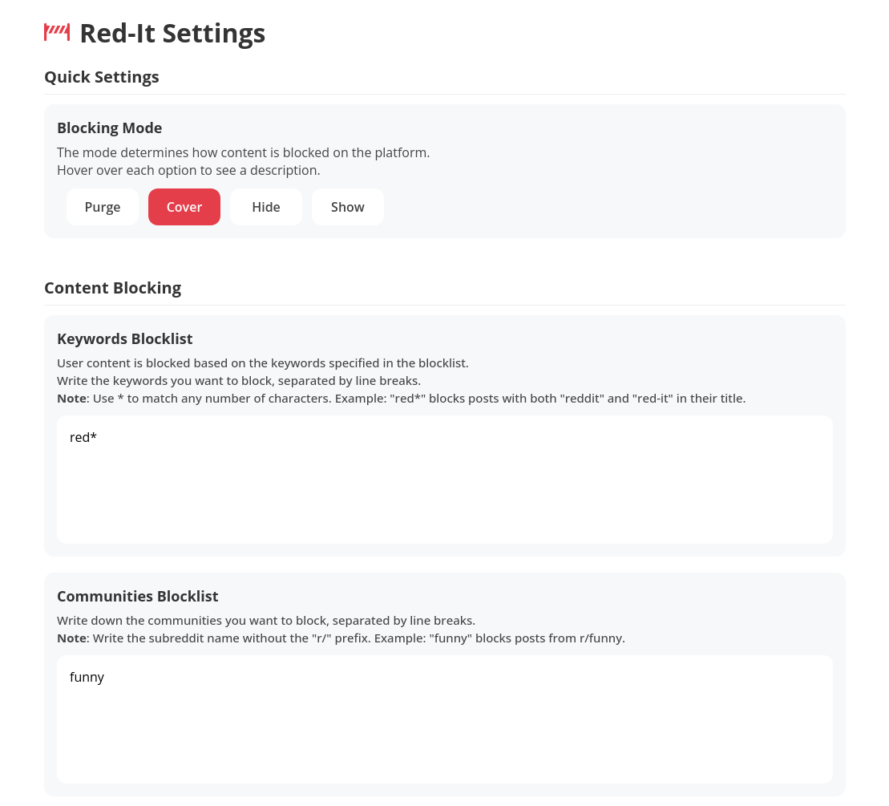

# Red-It

<p align="center">
  
</p>

<p align="center">
  <strong>Block posts on Reddit based on its content</strong>
</p>

<p align="center">
  
  
  
</p>

Red-It is a Firefox extension designed to enhance your Reddit browsing experience by allowing you to block unwanted posts based on keywords. Take control of your Reddit feed and filter out posts that contain specific words, phrases and simple patterns you'd rather not see.

**Recover your sanity while browsing, [install it now](https://addons.mozilla.org/en-US/firefox/addon/red-it/)! on your computer or mobile device!**

### ✨ Features

- 🚫 **Content Blocking**: Block Reddit posts containing specific keywords in their title
- 🎯 **Wildcard Support**: Use `*` to match any number of characters (e.g., "red\*" blocks both "reddit" and "red-it")
- ⚙️ **Easy Configuration**: Simple popup interface for quick access
- 🔄 **Real-time Filtering**: Content is filtered as you browse without page reloads
- 📝 **Usage Metrics**: Find out how many posts and subreddits have been blocked while you browsed
- 💾 **Persistent Storage**: Your settings are saved and synced across browser sessions

## 📦 Installation

Install it directly on your browser from the [Firefox Add-ons store page](https://addons.mozilla.org/en-US/firefox/addon/red-it/).

## 🧰 Usage Screenshots

### Popup

Popup that appears on the user's browser when the icon of the extension on the toolbar is clicked.

Extension metrics are displayed here.


### Popup with Menu Open

Extension popup with the "Mode" button focused after being clicked, expanding a submenu with different modes one can choose to hide the content of the page.

Available modes are:

- **Purge**: Removes the content from the page as if it wasn't there at all.
- **Cover**: Covers the content with a gray placeholder. The content is displayed when being hovered.
- **Hide**: Hides the content by making it invisible. Leaves a blank area on its position.
- **Show**: Disables the extension and shows all kinds of content without any blocking at all. No metrics aree collected.

The description of each mode is displayed when hovering them.


### Blocked Community Notice

This page is shown when the user tries to visit a community (subreddit) that is in their blocklist.

The only way to stop being shown is to remove the subreddit from the blocklist.


### Settings Page

This page has the following sections and features:

- General
  - Posts keyword blocklist
  - Communities/subreddits blocklist
  - NSFW posts blocking
- Technical
  - Extension inner workings logging on the console
- www.reddit.com
  - Block premium ads
- old.reddit.com
  - Block premium ad
- Extension
  - Delete data
  - Reset extension metrics

Bellow is a **portion** of the Settings page. To view the complete page, see [this screenshot](public/screenshot-settings-all.png).



## 🛠️ Usage

### Basic Setup

1. **Install the extension** following the installation instructions above
2. **Click the Red-It icon** in your Firefox toolbar
3. **Open Settings** to configure your blocklist
4. **Add keywords** you want to block (one per line)
5. **Browse Reddit** and enjoy your filtered experience!

### Keyword Syntax

- **Content per line**: each line is a different keyword or phrase for the extension to use as filter
- **Exact match**: `javascript` - blocks posts containing "javascript"
- **Wildcard**: `java*` - blocks posts containing "javascript", "java", etc.
- **Case insensitive**: All keywords are matched case-insensitively

## ❔ Permissions

Below are the following permissions the extension requires and what they are used for:

- **Storage**: saving and retrieving user-defined rules to block content with.
- **Tabs**: opening settings page and displaying blocked subreddit page.
- **WebRequest, WebRequestBlocking**: detecting subreddit access to deny access to it in case the subreddit is set by the user to be blocked by the extension.

## ℹ️ About

The extension is called "red-it" because the posts were initially hidden by a red rectangle instead of a white or gray one.
Even after changing the colors, I liked that the name resembles the target website and also sounds like it blocks its content.

## 📦 Development/debugging

1. **Clone the repository**

   ```bash
   git clone https://github.com/augustofrade/red-it-extension.git
   cd red-it-extension
   ```

2. **Load the extension in Firefox**
   - Open Firefox and navigate to `about:debugging`
   - Click "This Firefox" in the sidebar
   - Click "Load Temporary Add-on"
   - Select the `src/manifest.json` file from the cloned repository

## 📝 Reporting Issues

Found a bug or have a feature request? Please [open an issue](https://github.com/augustofrade/red-it-extension/issues) with:

- Clear description of the issue or feature
- Steps to reproduce (for bugs)
- Expected vs actual behavior
- Screenshots if applicable

## 📄 License

This project is free software. See the [LICENSE](LICENSE) file for details.

## Source

- Icons by [Font Awesome](https://fontawesome.com/)
